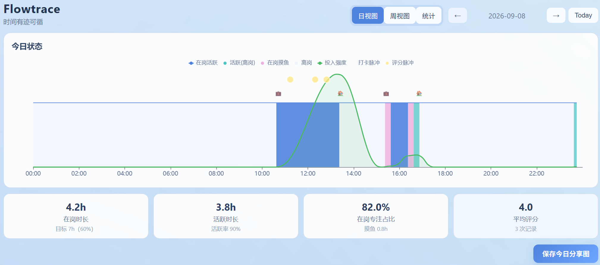
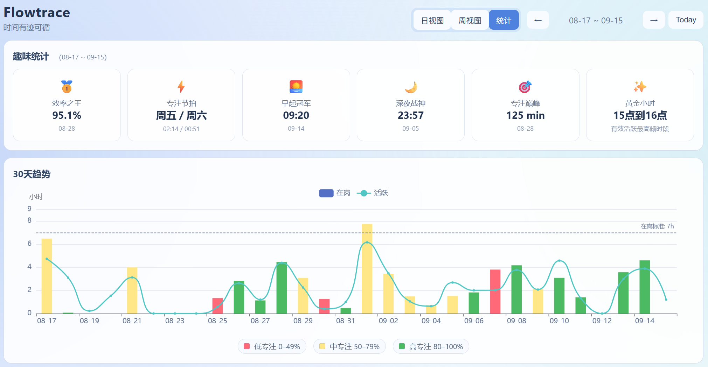
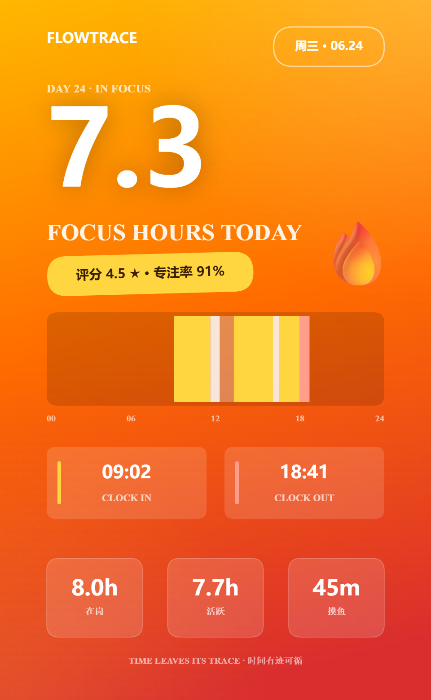
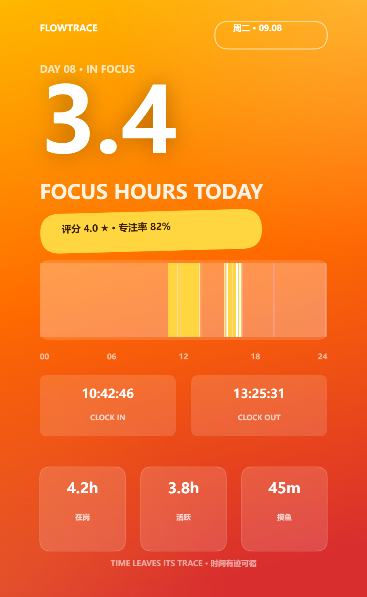
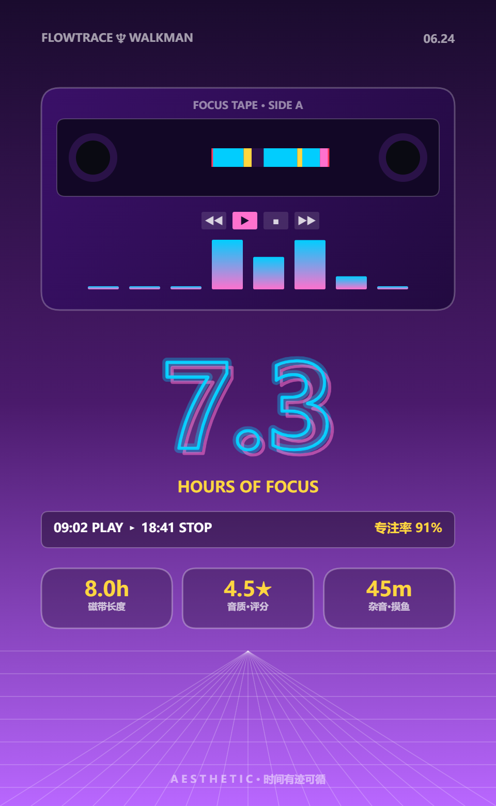

<div align="center">

# FlowTrace

**本地优先的个人工时与专注度追踪系统**

自动检测「活跃 + 在岗」，一次上云、多端监看 —— 时间有迹可循。

[](LICENSE)
[](https://www.python.org/)
[](https://github.com/SecieChuang/flowtrace/actions/workflows/tests.yml)
[](client/)
[](server/)

**English**: FlowTrace is a local-first, self-hosted personal time-tracking and focus-analytics system.
It automatically detects your *active* and *on-duty* time — no manual timers — and serves a Flask + SQLite
dashboard you can check from any device. No cloud account, no third-party analytics.

</div>

---

<table>
  <tr>
    <td></td>
    <td></td>
  </tr>
  <tr>
    <td align="center"><sub>日视图：时间线、投入强度与四格指标卡</sub></td>
    <td align="center"><sub>统计页：趣味统计与 30 天趋势（柱色 = 专注率分档）</sub></td>
  </tr>
</table>

## 核心特性

### 1. 活跃 + 在岗，双口径全自动检测

不用按开始/结束，不用手动记时。客户端持续识别键鼠活跃状态生成时间片段，
打卡只是「在岗」的锚点而非负担 —— 服务端自动调和两条信息源，跨零点下班也能正确推断：

- **三口径工时**：在岗 / 活跃 / 有效（在岗且活跃），专注率 = 有效 ÷ 在岗
- **摸鱼也能量化**：在岗但不活跃的时段单独成列，和「离岗」严格区分
- **数据会自己说话**：打卡缺漏、方向错误、孤立打卡由检测引擎自动发现，`manage_cli` 交互式修复

### 2. 一次上云，多端监看

服务端是一个 Flask + SQLite 进程（或一个 Docker 容器），部署到你自己的服务器后，
手机、平板、任何浏览器打开仪表盘就能看 —— 今天在工位干了多久、专注率如何，随时有数。
**数据完全自托管**：没有云账号、没有第三方分析，SQLite 文件就在你的机器上。

## 更多功能

| | |
|---|---|
| 🎯 **统计面板** | 30 天趋势（柱色按专注率分档）、上下班时间画像、周目标达成（时长 × 专注率 × 心情合成图）、有效工作日历热力、趣味统计 |
| ⭐ **自评分** | 活跃累计一定时长弹出 1–5 分即时评分，与产出交叉分析 |
| 🧾 **每日分享小票** | 一键把今天保存成「工时小票」图片（见下方示例） |
| 🤖 **AI 截图日报**（可选） | 定时截屏 + 任意 OpenAI 兼容 AI 服务（自定义 provider 名、base_url，支持 chat / responses 两种协议）生成每日时间线总结，webhook 推送飞书 |
| 📦 **离线队列** | 服务端不可达时事件暂存本地，恢复后自动补传 |
| 🐳 **Docker 部署** | 服务端自带 Dockerfile 与 docker-compose.yml |

### 工时小票 · 每日分享图

仪表盘点「保存今日分享图」，把今天在岗 / 有效专注 / 摸鱼时段 / 打卡记录导出成一张小票风格的图片（模板随机生成）——适合存档、日报，或者发给朋友看看今天有多拼。

<table>
  <tr>
    <td></td>
    <td></td>
    <td></td>
  </tr>
  <tr>
    <td align="center"><sub>模板 1</sub></td>
    <td align="center"><sub>模板 2</sub></td>
    <td align="center"><sub>模板 3</sub></td>
  </tr>
</table>

## 架构

```
  Collector (your Windows PC)                            Server (cloud host or local)
┌─────────────────────────────────────────┐            ┌───────────────────────────────────────────┐
│ client/scripts/flowtrace.ahk            │   HTTP     │ server/  (Docker or python server.py)     │
│ - keyboard/mouse activity fsm           │ ─────────► │ - Flask API + SQLite (<repo>/data/)       │
│ - clock-in hotkeys  ^+i / ^+o           │ X-API-Key  │ - checkin dedupe + overnight inference    │
│ - rating popup / offline queue          │ ◄───────── │ - detection engine (manage_cli repairs)   │
│ - optional screenshots + AI + webhook   │            │ - dashboard: daily / weekly / stats       │
└─────────────────────────────────────────┘            └───────────────────────────────────────────┘
                                                                       │ browser access
                                                                       ┌────────────┼────────────┐
                                                                       ▼            ▼            ▼
                                                                       desktop      phone      tablet
                                                                       (deploy once, watch anywhere)
```

客户端上报活动片段 / 打卡 / 评分 / 截图，并从服务端拉取配置与状态。更深入的架构说明见 [docs/architecture.md](docs/architecture.md)。

## 快速开始

### 服务端

Docker（推荐）：

```bash
cd server
cp config_example.json config.json   # 编辑 config.json，务必修改 api_key
docker compose up -d --build
```

Docker 模式默认把宿主机 `7292` 端口映射到容器 `8000`，访问仪表盘：`http://localhost:7292`。

或直接运行（Python 3.11）：

```bash
cd server
pip install -r requirements.txt
cp config_example.json config.json
python server.py
```

直接运行默认监听 `8000` 端口，访问仪表盘：`http://localhost:8000`。

数据库文件默认在仓库根目录 `data/flowtrace.db`（首次启动自动创建），备份直接复制该文件即可。

### 客户端（Windows）

前置：安装 [AutoHotkey v2](https://www.autohotkey.com/) 和 Python 3.11。

```bash
cd client
pip install -r requirements.txt
cp config/config_example.json config/config.json   # 填入服务器地址和 api_key
```

然后运行采集运行时 `client/scripts/flowtrace.ahk`（双击即可，或用 `client/scripts/start.bat`）。
上下班热键硬编码在 `flowtrace.ahk` 顶部（默认 `^+i` 上班 / `^+o` 下班，即 Ctrl+Shift+I / Ctrl+Shift+O），改热键直接编辑该文件。

可选：运行 `client/setup_all.bat` 一键注册开机自启和"截图日报"计划任务；`client/remove_all.bat` 反注册。

## 部署模式

| 配置项 | 本地模式（推荐个人使用） | 云端模式（多端监看） |
|---|---|---|
| 服务端 `host` | `127.0.0.1` | `0.0.0.0` |
| 服务端 `api_key` | 留空 `""`（不鉴权） | 设置为强随机串 |
| 客户端 `server_base_url` | 留空（自动回退 `http://localhost:8000`） | `http://<服务器地址>:7292`（Docker） |
| 客户端 `api_key` | 留空 | 与服务端相同 |

完整部署指南见 [docs/deployment.md](docs/deployment.md)。

## 测试

```bash
pip install pytest
python -m pytest tests
```

共 239 个用例，覆盖服务端 API、检测引擎、槽位填充和客户端同步/离线队列/截图等模块。

## 配置

- 服务端：`server/config_example.json` —— 监听地址、数据库路径、`api_key`、打卡去重、推断参数等
- 客户端：`client/config/config_example.json` —— 服务器地址、空闲阈值、评分频率、截图与 AI 日报开关等（热键在 `flowtrace.ahk` 顶部修改）

**每个字段的完整说明**见 [docs/configuration.md](docs/configuration.md)。

两个 `config.json` 都在 `.gitignore` 中，不会被提交。**请勿在任何公开位置分享你的 `config.json`。**

## 隐私说明

- 所有数据（活动片段、打卡、评分、截图）只存放在你自己机器上的 SQLite 数据库和本地目录中，没有任何外部回传
- 截图 / 摄像头采集为可选功能，可在客户端配置中完全关闭；本地保留期可配置
- AI 日报仅在主动配置 provider API key 后才会把截图发给对应服务商；不配置则完全不启用，没有任何数据外发

## 文档

- [docs/configuration.md](docs/configuration.md)：服务端与客户端全部配置字段说明
- [docs/deployment.md](docs/deployment.md)：本地 / 云端两种部署模式、备份、升级与卸载
- [docs/architecture.md](docs/architecture.md)：系统架构、数据模型与检测引擎
- [docs/manage-cli-guide.md](docs/manage-cli-guide.md)：数据核查 CLI 使用指南
- [docs/clock-detection-architecture-final.md](docs/clock-detection-architecture-final.md)：打卡检测框架设计定稿（V4）

## 目录结构

```
client/    Windows 客户端（AHK 采集运行时、热键、截图、AI 调用）
server/    服务端（Flask API、SQLite、检测/推断逻辑、仪表盘静态页、Docker）
docs/      架构设计文档与事故复盘
scripts/   数据迁移与修复辅助脚本
tests/     pytest 测试套件（239 个用例）
```

## License

[MIT](LICENSE) © 2026 SecieChuang
